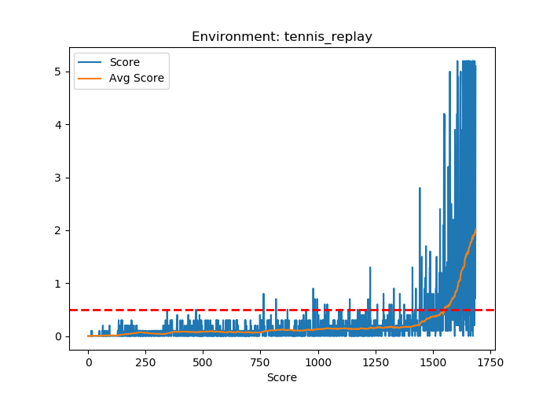
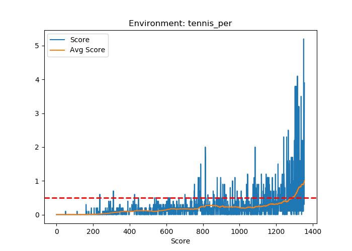

# Tennis Game Report

## Learning Algorithm
I've based my implementation on the multi agent deep deterministic gradient method (MADDPG), [see paper](https://arxiv.org/abs/1706.02275). MADDPG is extension of the single agent DDPG algorithm I used during the [reacher project](https://github.com/MathiasGruber/ReacherAgent-PyTorch). The DDPG agent is an actor-critic method, which has been shown to perform well in environments with a continuous action space, which are not well handled by the DQN algorithm and its various extensions. The algorithm consists of two neural networks, the *actor* and the *critic*, where the *actor* is used to approximate the optimal deterministic policy, while the *critic* learns to evaluate the optimal action-value function based on actions from the *actor*. The idea is thus that the *actor* is used for specifying actions *a*, while the *critic* calculates a temporal difference error (TD error) that criticizes the actions made by the *actor*. In the case of multiple agents, i.e. the MADDPG algorithm, the critic is given information about the state and action from all agents, whereas the actors are only given information pertaining to the agent in question, meaning that at inference time it can act independently of the other agents.

Following the same convergence arguments as found in the DQN algorithm, DDPG actually employs 4 neural networks; a local actor, a target actor, a local critic and a target critic. In addition, we also need to employ replay buffer in order to account for temporal sample correlation, and we use a so-called 'soft update' mechanism to update the weights of the target networks slowly - i.e. we continously slowly update the target networks based on the parameters in the local networks. In this solution, I've also implemented prioritized experience replay for DDPG, which works exactly the same as the implementation for DQN.

The learning algorithm is detailed by the following:


## Hyperparameters
I had to play a bit with the parameters to get the network training - most importantly was reducing the OU noise from 0.2 to 0.05 though. Everything else is pretty standard - the number of network nodes ([400, 300]) were those used in the original DDPG paper, however I concatenated actions into the first layer of the critic, instead of the 2nd layer which they did in the paper.

```
BATCH_SIZE = 512        # Batch Size
BUFFER_SIZE = int(1e6)  # Memory capacity
GAMMA = 0.99            # Discount factor
LR_ACTOR = 5e-4         # Actor lerning rate
LR_CRITIC = 5e-4        # Critic learning rate
TAU = 5e-2              # Soft update of target networks
WEIGHT_DECAY = 0        # L2 weight decay for Critic
NOISE_SIGMA = 0.05      # sigma for Ornstein-Uhlenbeck noise

# Actor
dense_layers=[400, 300]

# Critic
dense_layers=[400, 300]
```

### Model Architecture
The **actor** network consists of three fully connected layers, where the first two have relu activations, and the final output layer yields 4 values with a tanh activation.

The **critic** also consists of three fully connected layers, where the first two have relu activations, and the action-vector is concatenated to the input into of the first layer. The final layer has a single output.

As described in the [original DDPG paper](https://arxiv.org/abs/1509.02971v5), weights are initialized from uniform distributions based on the fan-in of the layer, except for the last layer which was initialized with from a uniform distribution from -3e-3 to 3e-3. Each agent in the MADDP algorithm has its own actor and critic networks.

## Results / Plots of Rewards
The main investigation of this report was how priotized experience replay would influence the results. The environment seems to be solved quicker with PER from the results shown below, however, during development I saw quite different solution times, so I'm not sure whether this observation is statistically significant, or just luck in this case.

<p float="left">
  
  
</p>

## Future Work
The main addition to off-the-shelf DDPG in this repository is prioritized experience replay. For future improvements of the MADDPG agent, I'd look into:
- [ ] I'd look into further tuning hyperparameters
- [ ] I'd try reducing the Ornstein-Uhlenbeck noise as more episodes are played, and in general look more into this parameter
- [ ] I'd try to have the agent play the more complex [soccer environment](https://github.com/Unity-Technologies/ml-agents/blob/master/docs/Learning-Environment-Examples.md)